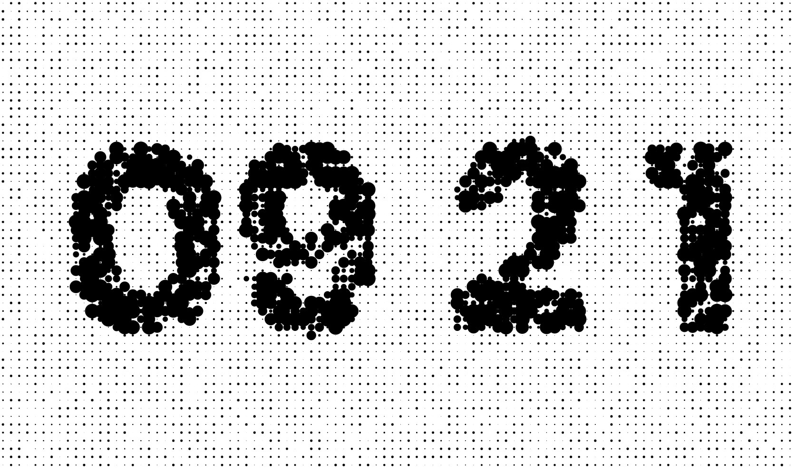
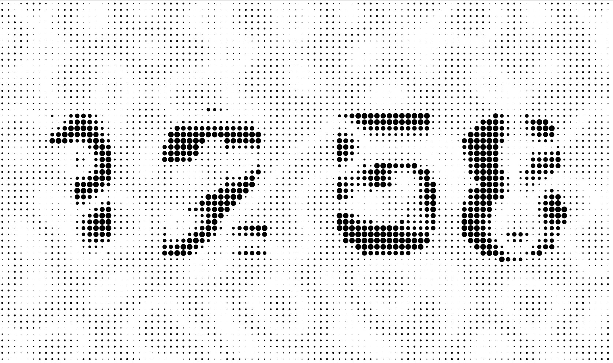
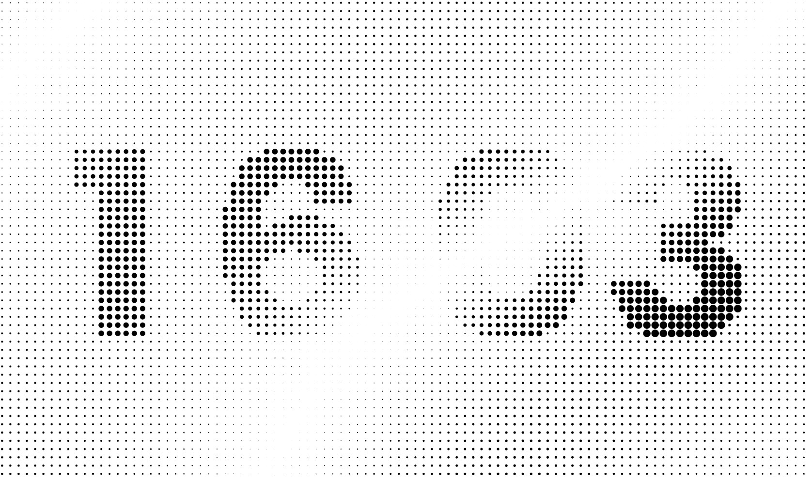
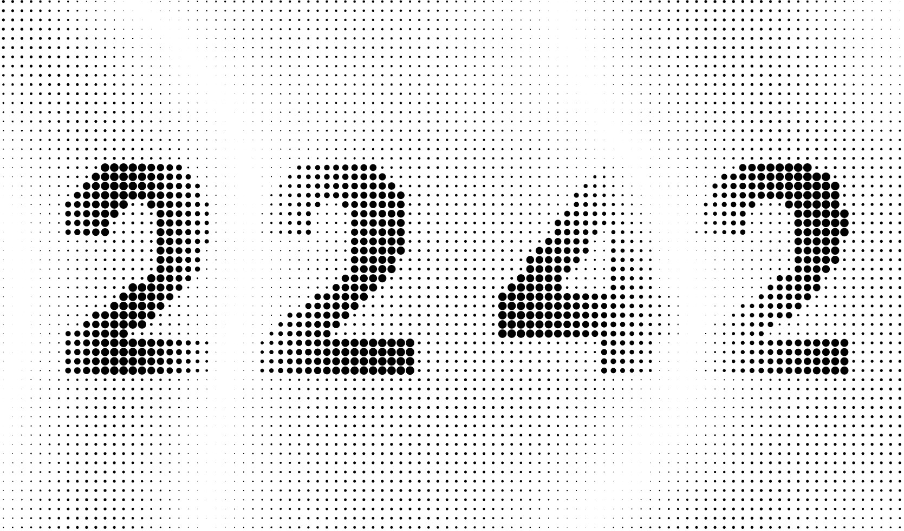
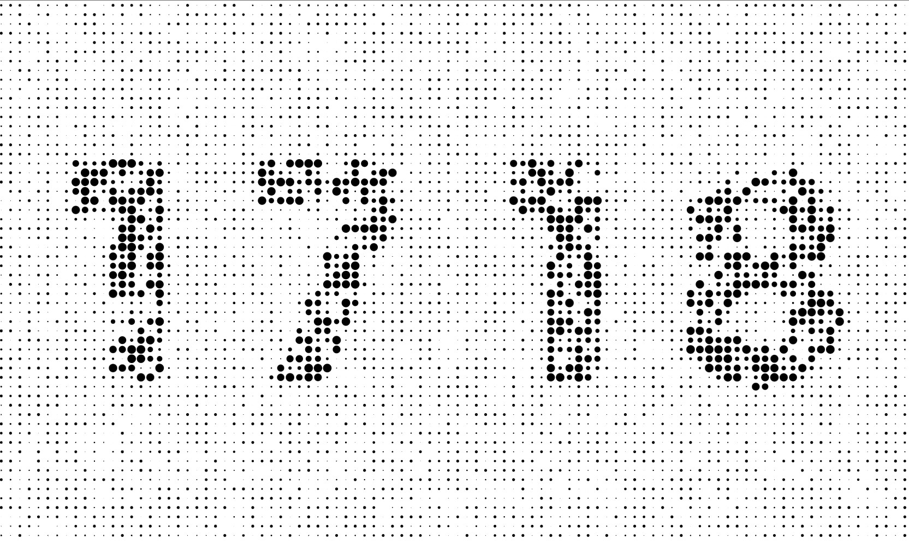

# Dots Clock

Dots Clock is a digital clock written in Flutter, Dart. It was developed for the [Flutter Clock challenge](https://flutter.dev/clock). 

# Table of Contents
- [Clock Variations](#clock-variations)
- [Design Philosophy](#design-philosophy)
  * [Goals](#goals)
  * [Implementation](#implementation)
- [Final Thoughts](#final-thoughts)

# Clock Variations

| Variation    | Screenshot                   | Motion Design                      |
|--------------|------------------------------|------------------------------------|
|Standard      |      |[Youtube](https://flutter.dev/clock)|
|Blobs         |         |[Youtube](https://flutter.dev/clock)|
|Gooey         |         |[Youtube](https://flutter.dev/clock)|
|Cellular Noise||[Youtube](https://flutter.dev/clock)|
|Cubic Noise   |   |[Youtube](https://flutter.dev/clock)|
|Simplex Noise | |[Youtube](https://flutter.dev/clock)|
|Value Noise   |   |[Youtube](https://flutter.dev/clock)|
|White Noise   |   |[Youtube](https://flutter.dev/clock)|

# Design Philosophy

## Goals

The clock is meant to simulate a **living, breathing entity** that, while displaying time information, is also an **interesting and soothing experience** to look at. It should interest the viewer and spark just enough intrigue to still disappear into the background of your living space. I would describe this attribute of the clock its "lava lampdness".

## Implementation

With a grid of dots which vary in sizes through a noise function of choice, we make each dot appear as their own organism that pursues individual tasks. Each dot pulses with a sine wave function to simulate a **calming breathing pattern**. For the clock's standard variation we choose Perlin noise to size dots that are closer to each other similarly. So while they appear acting independantly, they also seem to work towards a common goal. A **collection of entities that together form a much larger functional one** makes for a compelling viewing experience where the viewer can observe each dot independantly to make out a pattern or take a step back to have a look at the bigger picture.

While it needs to be interesting to look at when in focus, it also needs to disappear into the background when not needed to not intrude upon one's living space. For this purpose, the clock's **colors and shapes remain understated**, using only monocolor tones (which are slightly off-color) and circles to convey the experience. After all, the clock's static **image is only secondary and the motion design shall be the primary attraction**.

For the font that displays the time, Poppins is a natural choice with its **bold and easy to recognize silhouette**. Since the dot grid reduces the resolution and detail level of the font, it couldn't have been one with complex or thin shapes otherwise it would be drowned out by the dots' animations. The fonts is masked onto the grid and scales up the dots that are contained in it. The transitions between different clock face states is smoothed out with the dots slowly scaling up or down to their new state to make it like look a whole **group of dots is consciously shifting their focus to display the next numbers** on the clock.

# Final Thoughts

Dots Clock is an exercise in **emergent motion design**. It was unknown to me how the final clock would look likte until it was actually built since the clock is modeled after realistic patterns and physics rules. The Perlin noise I employed is the same function that visual artists use to generate organic effects such as clouds, fire or landscape terrain. This connection to real-life helps it stand out as a force of nature rather than just a clock.

